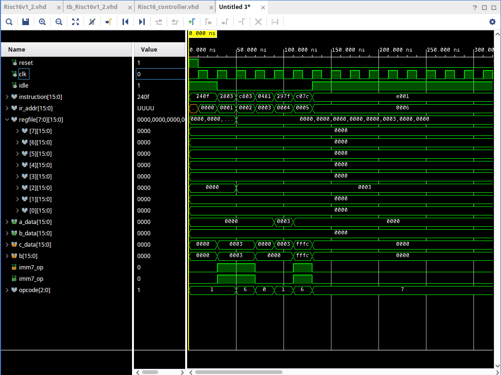

# RISC16 Single-Cycle Processor | Basys3 FPGA

A 16-bit single-cycle RISC processor implemented in VHDL, targeting the Digilent Basys3 development board.

---

## Architecture

The processor follows a classic single-cycle datapath design with a 3-bit opcode space.

### Clock Source
The processor has two clocks. One for the 7-Segment-multiplexing (default: 100Mhz) which gets turned into 1kHz in the dec_16bit_to_7seg entity and one system clk (default 5MHz). This is implemented through the clocking wizard IP. 

### Debug Mode

- **LEDs** display the current instruction from left to right
- **7-segment display** always shows the current Program Counter value in hexadecimal (both in normal operation and debug mode)

When the processor halts (after a `HALT` instruction), it enters debug mode:
- **LEDs** display the content of the register selected via switches 0–2

---

## Todo

1. Fix 7-segment display - probably ghosting or simmilar see: https://electronics.stackexchange.com/questions/365130/ghosting-on-7-segment-display
2. Adjust Block Diagram for inverted 7segment signals 
3. Implement missing instructions (`LW`, `SW`, etc.)
3. Add build tcl script

---

## Known Limitations & Potential Error Sources

- `a_equ_b` is not reset between instructions — it retains its value from the last `BEQ` and is not cleared until the next `BEQ` executes.
- Signals like `a_equ_b` have no default value and remain uninitialized (`U`) until first written.

---

## Lessons Learned

### VHDL Process Sensitivity Lists

**Symptom:** The controller only ever produced outputs for the first `"000"` opcode case, regardless of the actual instruction being decoded.

**Investigation:** The waveform below shows the controller outputs frozen despite changing instructions.

**Root cause:** The sensitivity list of the output process contained `instruction` instead of `opcode`. Even though `opcode` was correctly assigned to the upper three bits of `instruction` outside the process, the simulation never picked up on the change.

**Fix:** Replace `instruction` with `opcode` in the sensitivity list of the output process.

**Takeaway:** Still not sure how the simulation works see: [vhdl-online.de | Process Execution](https://www.vhdl-online.de/courses/system_design/vhdl_language_and_syntax/process_execution) for further background.

### Constraint file

Only ports of the top level entity can be mapped to the constraint file. This means if you want to connect the debug_addr - which are needed by the `dp_alu_regfile` entity - you have to connect the signal throug every layer of the Risc16v1_2 entity. 
This not only adds much overhead to the different layers but also reduces reusablity of the different modules.  

Clk signal can not be mapped to a button or simmilar. This happens because vivado doesnt allow buttons as they are not stable clk sources. You would then have to debounce the button yourself.

Every toplevel port has to be mapped to the constraints file!

--- 

Combinatory loops can be caused as the instruction is partly mapped to itself through the beq commands hardware implementation (eg. 2k extender, imm16, mux). This has to be disabled through the constraints file.

### IP Integration
I have integrated my first IP into a project. I used the clocking_wizard IP to split my 100MHz system clk into on clock for the 7semgent multiplexing and one for the processor.

### Seven Segment Display
When trying to display a number across all four seven segment displays it is important that the clocking frequency isnt too high or else all of the displays will be completly lit. A 1kHz frequency is ideal - 15ms for each display.
7segment disaply works with inverted - low active - signals.
